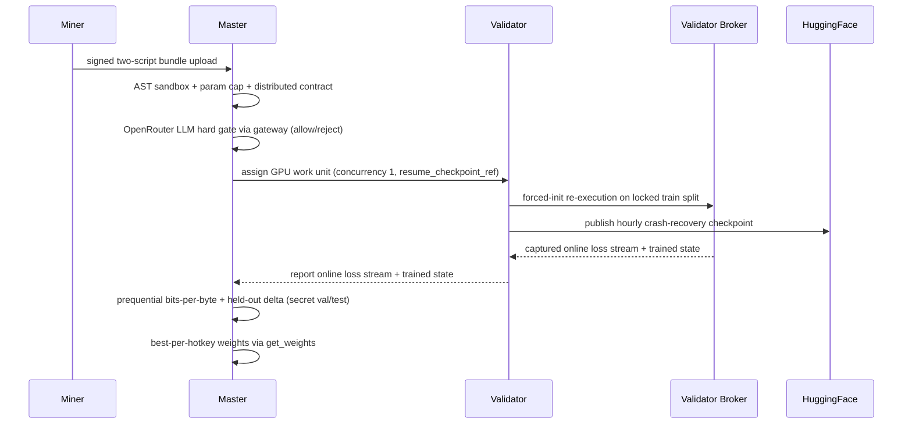

<div align="center">

# PRISM

**An "ability to learn" ML challenge: two-script submissions, locked data, challenge-owned scoring**

**[Overview](docs/overview.md) • [Miner Guide](docs/miner/README.md) • [Validator Guide](docs/validator/README.md) • [Architecture](docs/architecture.md) • [Scoring](docs/scoring.md) • [Security](docs/security.md)**

[](https://github.com/BaseIntelligence/prism/blob/main/LICENSE)
[](https://bittensor.com/)
[](https://joinbase.ai)


</div>

---

## Overview

PRISM is a BASE subnet that measures a model's **ability to learn** from scratch. Miners submit
two scripts: a model `architecture.py` and a custom `training.py` loop. The challenge owns the
dataset (locked FineWeb-Edu raw text, mounted read-only, no network) and the evaluation. Evaluation
is **decentralized**: online validators pull a submission's work unit from the master coordination
plane (one prism unit per validator at a time) and **re-execute** the miner's training loop on their
own broker under a **forced random initialization** (fixed seed), ignoring anything the miner
reports. The **master** holds the secret held-out splits, finalizes the held-out delta, and computes
the per-hotkey weights; it coordinates and aggregates but never executes.

The score is a prequential (online) compression metric in **bits-per-byte (bpb)**: the area under
the from-scratch loss curve, normalized by the raw bytes of text consumed. A model that learns
faster compresses the stream better and earns a better score. This is robust by construction:
because the validator forces random init, smuggled pretrained weights are inert; because each token
is scored before it is trained on, there is no held-out leakage; and because the metric integrates
the whole curve, single-checkpoint gaming fails.

## What The Subnet Does

1. A miner submits a two-script bundle (`architecture.py` + `training.py`).
2. PRISM validates the two-script contract and runs the static AST sandbox.
3. A strong **OpenRouter** LLM (`openai/gpt-4o`) reviews both scripts as a hard gate and can reject
   before any GPU work. The gate runs on the master through the OpenRouter gateway (temperature 0);
   validators hold no provider keys.
4. The master coordination plane assigns the submission's single GPU work unit to one online
   validator, which re-executes the training loop on its own broker under a forced random init on
   the locked FineWeb-Edu train split (concurrency 1 per validator).
5. The master computes the prequential bits-per-byte score plus a held-out delta tie-breaker from the
   validator-reported online loss stream and trained state, using the secret held-out splits it
   alone holds.
6. Scores rank on the leaderboard and convert into normalized, best-per-hotkey BASE weights.

## The v2 System At A Glance

- **Two-script submission contract**: `architecture.py` exposes `build_model(ctx)`; `training.py`
  exposes `train(ctx)`. The miner owns the training loop; the challenge owns the data and the score.
  A single combined module no longer satisfies the contract.
- **Locked FineWeb-Edu data plane**: a pinned FineWeb-Edu subset split into `train` (miner-visible,
  bind-mounted read-only with `network=none` and `HF_HUB_OFFLINE=1`) and secret `val`/`test` that
  never leave the master and are never exposed to miners or validators.
- **Forced-init re-execution**: the challenge runner forces the seed and deterministic flags before
  importing the miner code, then launches `torchrun --standalone --nnodes=1 --nproc-per-node=1`.
- **Decentralized execution**: a submission becomes exactly one GPU work unit that the master
  coordination plane assigns to a single online validator (concurrency 1); the validator re-executes
  on its own broker. The master coordinates and aggregates but never runs the eval container.
- **HuggingFace crash-recovery checkpoints**: validators publish training checkpoints to HuggingFace
  on an hourly cadence (configurable) through a signed, permit-gated master intake endpoint; on a
  crash or reassignment the unit resumes from the last published checkpoint (delivered as
  `resume_checkpoint_ref`) rather than restarting.
- **Prequential bits-per-byte scoring**: the primary, tokenizer-agnostic, compute-normalized metric,
  with a held-out delta-over-random-init tie-breaker and an anti-memorization gap penalty.
- **OpenRouter LLM hard gate**: `openai/gpt-4o` reviews both scripts on the master through the
  OpenRouter gateway (temperature 0); a `reject` is terminal. Validators hold no provider keys, and
  `llm_review` fails closed when a gateway URL is configured but its scoped token is unresolvable.
- **Single-node multi-GPU contract**: the miner's loop scales across 1-8 GPUs; the scored run uses
  `nproc=1` (one physical GPU); correctness is validated with static checks and a gloo multi-rank test.
- **Dry-run weights**: the master computes best-per-hotkey scores from validator-reported results
  and exposes them through the unchanged `get_weights` contract; prism itself never writes on-chain,
  and chain submission runs dry-run/mock in tests.

---

## Submission Scope

PRISM fixes the dataset and the evaluation protocol, not the model search space. A miner may submit
any valid `torch.nn.Module` through `architecture.py::build_model(ctx)` and any training procedure
through `training.py::train(ctx)`, subject to the AST sandbox, the 150M parameter cap, and the
resource limits.

The challenge re-executes that loop on the locked FineWeb-Edu train split under a forced random init
and records the online loss stream itself. Any metric the miner logs or any manifest the miner writes
is ignored: scoring always reads the **challenge-authored** `prism_run_manifest.v2.json`.

For the scoring basis, see [Scoring and rewards](docs/scoring.md) and [Scaling evaluation](docs/scaling.md).
For the sandbox, LLM gate, and anti-cheat model, see the [Security model](docs/security.md).

---

## Documentation Index

- [Miner guide](docs/miner/README.md)
- [Validator guide](docs/validator/README.md)
- [Overview](docs/overview.md)
- [Architecture](docs/architecture.md)
- [Submission format](docs/submissions.md)
- [Scoring and rewards](docs/scoring.md)
- [Scaling evaluation](docs/scaling.md)
- [Security model](docs/security.md)

---

## System Flow

```mermaid
flowchart LR
    Miner[Miner] --> Master[Master Coordination Plane]
    Master --> Static[Static Sandbox]
    Static --> LLM[OpenRouter Gateway Gate]
    LLM --> Assign[Assign GPU Work Unit]
    Assign --> Validator[Validator Broker]
    Validator --> Reexec[Forced-Init Re-Execution]
    Reexec --> Heldout[Master Held-out Delta]
    Heldout --> Score[Prequential bpb + Tie-breaker]
    Score --> Weights[Best-per-hotkey Weights]
```





---

## Anti-Cheat By Construction

PRISM is designed so the common cheats are inert rather than merely detected:

- **No pretrained weights**: the validator forces random init, so smuggled weights produce an
  anomalous step-0 loss that zeroes the score; the container runs `network=none` and the sandbox
  blocks IO/network/deserialization escapes.
- **No metric manipulation**: the challenge re-executes and computes the metric itself from the
  online loss it captured; miner-reported numbers and miner-written manifests are ignored.
- **No memorization**: the `val`/`test` splits are secret, held only on the master, and never
  exposed to miners or validators; an excessive train-vs-held-out gap penalizes the score.
- **Determinism**: fixed seeds, deterministic algorithms, and a challenge-controlled data order make
  the same submission reproduce the same score within tolerance.

See [Security model](docs/security.md) for the full anti-cheat and sandbox policy.

---

## Repository Layout

```text
prism/
  assets/                     # README and documentation images
  docs/                       # Project documentation
  scripts/                    # One-time data + tokenizer prep CLIs and a local staging driver
  src/prism_challenge/        # Challenge app, repository, evaluator, and SDK helpers
    coordination.py          # Pending work-unit exposure to the master coordination plane
    validator_executor.py    # Validator pull/execute/post cycle on its own broker
  src/prism_challenge/evaluator/
    components.py             # Two-script contract resolution and fingerprints
    container.py             # Forced-init re-execution runner (challenge-owned)
    dataset.py               # Locked FineWeb-Edu loader (pinned splits + MANIFEST)
    scoring.py               # Prequential bits-per-byte scoring
    heldout.py               # Master-side held-out delta (RCE-safe trained-state load)
    llm_review.py            # OpenRouter LLM hard gate via the master gateway
    checkpoint_publisher.py  # HuggingFace checkpoint publisher interface (mocked in tests)
    checkpoint_intake.py     # Master-side checkpoint intake, HF publish, and ref recording
    checkpoint_push.py       # Validator-side checkpoint cadence and push client
  tests/                      # Sandbox, scoring, harness, dataset, anti-cheat, and doc tests
  config.example.yaml         # Production-oriented example config
  Dockerfile                  # Challenge image
```

---

## Development

Run the same checks CI enforces:

```bash
uv run ruff check .
uv run mypy
uv run pytest --cov=prism_challenge --cov-fail-under=80
```

GPU re-execution, HuggingFace publication, and LLM provider calls are mocked in the test suite; the
real GPU, HuggingFace token, and provider keys are wired only at deploy.

---

## License

Apache-2.0
