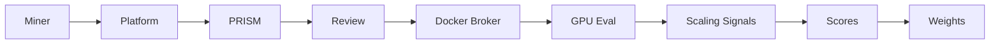
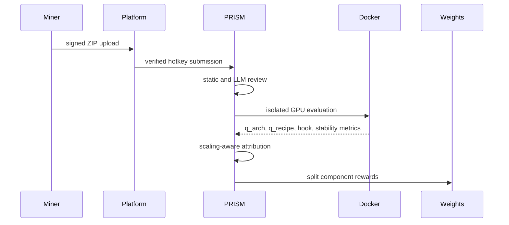

<div align="center">

# PRISM

**Decentralized neural architecture search for frontier-model research**

**[Overview](docs/overview.md) • [Miner Guide](docs/miner/README.md) • [Validator Guide](docs/validator/README.md) • [Architecture](docs/architecture.md) • [Scoring](docs/scoring.md) • [Security](docs/security.md)**

[](https://github.com/PlatformNetwork/prism/blob/main/LICENSE)
[](https://bittensor.com/)
[](https://platform.network)


</div>

---

## Overview

PRISM is a Platform subnet for **decentralized neural architecture search**. Miners submit model
architecture and training ideas, PRISM evaluates them in isolated benchmark environments, and the
subnet rewards ideas that show better architecture quality, training behavior, and scaling signals.

The goal is not to train frontier models directly inside the subnet. Instead, PRISM searches the
design space around frontier-model building blocks using compact evaluations that are fast enough
for subnet operation while still surfacing useful architecture, optimizer, loss, inference, and
scaling-law signals.

## What The Subnet Does

1. Miners submit architecture or training variants.
2. PRISM validates the submission contract and reviews the bundle for safety.
3. The evaluator measures proxy learning quality, training behavior, stability, and scaling signals.
4. Architecture ownership and training ownership are attributed separately.
5. Meaningful improvements receive component rewards.
6. Final architecture and recipe scores are converted into raw Platform weights.

## What PRISM Rewards

- **Architecture discovery**: first discovery of a meaningful architecture family earns architecture ownership.
- **Training and inference improvement**: later miners can improve optimizer setup, inference logits, loss computation, or train-step code for an existing architecture and earn training ownership.
- **Robust improvements**: dynamic thresholds and noise checks prevent tiny random metric changes from stealing rewards.
- **Scaling-aware signals**: PRISM emphasizes smooth loss curves, stable gradients, activation stability, and consistent improvements across model size, depth, sequence length, and batch scaling.
- **Secure execution**: submitted code is reviewed statically and by optional LLM policy checks, then executed only inside isolated containers through the Platform Docker broker.

---

## Documentation Index

- [Miner guide](docs/miner/README.md)
- [Validator guide](docs/validator/README.md)
- [Overview](docs/overview.md)
- [Architecture](docs/architecture.md)
- [Submission format](docs/submissions.md)
- [Scoring and rewards](docs/scoring.md)
- [Scaling evaluation](docs/scaling.md)
- [Security model](docs/security.md)

---

## System Flow





---

## Scaling-Law Evaluation Philosophy

PRISM is designed to avoid rewarding signals that often fail at scale. Weak predictors include early MMLU-style benchmarks, subjective chat quality, final perplexity alone, single-seed results, and very short training runs without extrapolation.

The strongest proxy signals are:

- smooth loss curves without oscillation;
- stable gradient norms without silent explosion;
- absence of activation spikes, especially for paths that could scale beyond 10B parameters;
- coherent improvements across model sizes, such as similar gains at 125M, 350M, and 1B proxy scales;
- depth, sequence, and batch scaling tests that expose residual-stream drift, MoE routing collapse, KV-cache degradation, normalization failures, overflow, NaNs, and gradient-noise problems.

See [Scaling Evaluation](docs/scaling.md) for the complete scaling policy.

---

## Repository Layout

```text
prism/
  assets/                     # README and documentation images
  docs/                       # Project documentation
  src/prism_challenge/        # Challenge app, repository, evaluator, and SDK helpers
  src/prism_challenge/evaluator/
    components.py             # Architecture/training manifest parsing and fingerprints
    container.py              # Isolated evaluation runner
  tests/                      # API, scoring, broker, executor, and safety tests
  config.example.yaml         # Production-oriented example config
  Dockerfile                  # Challenge image
```

---

## License

Apache-2.0
