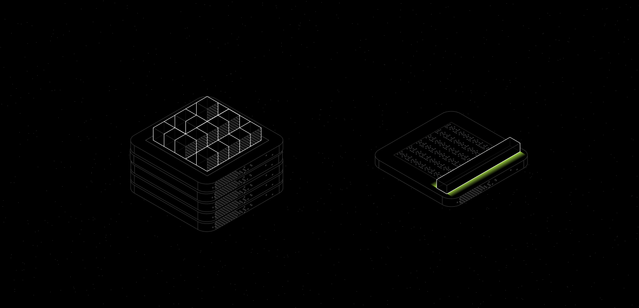
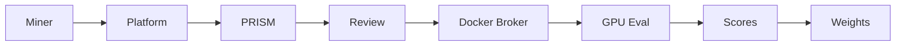
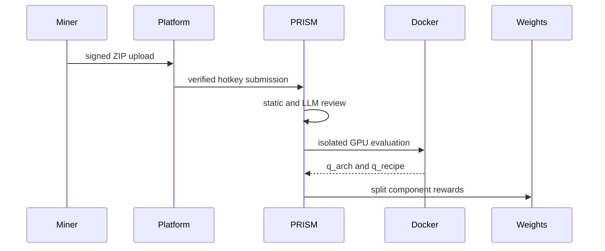

<div align="center">

# PRISM

**Decentralized neural architecture search for frontier-model research**

**[Overview](docs/overview.md) • [Architecture](docs/architecture.md) • [Submissions](docs/submissions.md) • [Scoring](docs/scoring.md) • [Security](docs/security.md) • [Operators](docs/operators.md) • [API](docs/api.md)**

[](https://www.python.org/)
[](https://fastapi.tiangolo.com/)
[](https://bittensor.com/)
[](https://platform.network)



</div>

---

## Overview

PRISM is a Platform Network challenge for **decentralized neural architecture search**. Miners submit Python projects that define model architectures, training recipes, and inference hooks. PRISM evaluates those projects in isolated GPU containers on smaller proxy models, then rewards the ideas that produce better architecture and training behavior.

The goal is not to train frontier models directly inside the challenge. Instead, PRISM searches the design space around frontier-model building blocks using compact evaluations that are fast enough for a subnet, but rich enough to surface useful architecture, optimizer, loss, and inference patterns.

## What PRISM Rewards

- **Architecture discovery**: first discovery of a meaningful architecture family earns architecture ownership.
- **Training and inference improvement**: later miners can improve training code for an existing architecture and earn training ownership.
- **Robust improvements**: dynamic thresholds and noise checks prevent tiny random metric changes from stealing rewards.
- **Secure execution**: submitted code is reviewed statically and by optional LLM policy checks, then executed only inside isolated containers through the Platform Docker broker.

---

## Documentation Index

- [Overview](docs/overview.md)
- [Architecture](docs/architecture.md)
- [Submission Format](docs/submissions.md)
- [Scoring and Rewards](docs/scoring.md)
- [Security Model](docs/security.md)
- [Operator Guide](docs/operators.md)
- [API Reference](docs/api.md)

---

## System Flow





---

## Quick Start

```bash
git clone https://github.com/PlatformNetwork/prism.git
cd prism
python -m venv .venv
.venv/bin/python -m pip install -e ".[dev]"
.venv/bin/pytest
```

Run the API locally with a development shared token:

```bash
PRISM_SHARED_TOKEN=dev-secret \
PRISM_DATABASE_URL=sqlite+aiosqlite:///./prism.sqlite3 \
.venv/bin/uvicorn prism_challenge.app:app --host 0.0.0.0 --port 8000
```

Validate the project:

```bash
.venv/bin/ruff check src tests
.venv/bin/ruff format --check src tests
.venv/bin/mypy --config-file pyproject.toml src
.venv/bin/pytest tests
```

---

## Miner Project Contract

Miners submit a `.zip` project with Python code and an optional `prism.yaml` manifest.

```yaml
kind: full
architecture:
  entrypoint: src/model.py
training:
  entrypoint: src/train.py
```

The architecture entrypoint must expose:

```python
def build_model(ctx):
    ...

def get_recipe(ctx):
    ...
```

Optional hooks can customize training and inference:

- `configure_optimizer(model, recipe, ctx)`
- `inference_logits(model, batch, ctx)` or `infer(model, batch, ctx)`
- `compute_loss(model, batch, ctx)`
- `train_step(model, batch, optimizer, ctx)`

See [Submission Format](docs/submissions.md) for complete examples.

---

## Challenge Contract

PRISM is a standard Platform challenge. It exposes:

- `GET /health`
- `GET /version`
- `POST /v1/submissions`
- `GET /v1/submissions/{submission_id}`
- `GET /v1/leaderboard`
- `GET /v1/architectures`
- `GET /v1/training-variants`
- `GET /internal/v1/get_weights`

Platform also forwards verified uploads to:

- `POST /internal/v1/bridge/submissions`

Validators can use internal assignment routes when PRISM is run in validator-assignment mode.

---

## Repository Layout

```text
prism/
  assets/                     # README and documentation images
  docs/                       # Project documentation
  src/prism_challenge/        # FastAPI app, repository, evaluator, SDK helpers
  src/prism_challenge/evaluator/
    components.py             # Architecture/training manifest parsing and fingerprints
    container.py              # Isolated Docker/GPU evaluation runner
  tests/                      # API, scoring, broker, executor, and safety tests
  config.example.yaml         # Production-oriented example config
  Dockerfile                  # Challenge image
```

---

## Current Status

PRISM currently supports:

- Platform bridge uploads with verified miner hotkeys.
- ZIP multi-file Python projects.
- GPU-only remote evaluation through the Platform Docker broker.
- Static source checks, optional LLM review, plagiarism review, and ZIP hardening.
- Architecture-family ownership.
- Training-variant ownership for existing architectures.
- Dynamic absolute, relative, and z-score improvement thresholds.
- Standard Platform `get_weights` integration.
