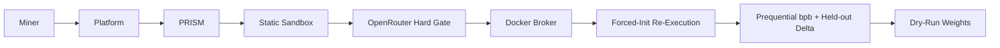
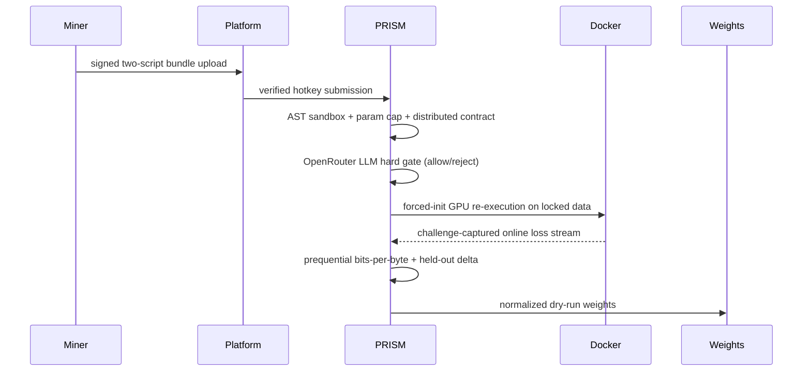

<div align="center">

# PRISM

**An "ability to learn" ML challenge: two-script submissions, locked data, challenge-owned scoring**

**[Overview](docs/overview.md) • [Miner Guide](docs/miner/README.md) • [Validator Guide](docs/validator/README.md) • [Architecture](docs/architecture.md) • [Scoring](docs/scoring.md) • [Security](docs/security.md)**

[](https://github.com/PlatformNetwork/prism/blob/main/LICENSE)
[](https://bittensor.com/)
[](https://platform.network)


</div>

---

## Overview

PRISM is a Platform subnet that measures a model's **ability to learn** from scratch. Miners submit
two scripts: a model `architecture.py` and a custom `training.py` loop. The challenge owns the
dataset (locked FineWeb-Edu raw text, mounted read-only, no network) and the evaluation. The
validator **re-executes** the miner's training loop under a **forced random initialization** (fixed
seed) and **computes the score itself**, ignoring anything the miner reports.

The score is a prequential (online) compression metric in **bits-per-byte (bpb)**: the area under
the from-scratch loss curve, normalized by the raw bytes of text consumed. A model that learns
faster compresses the stream better and earns a better score. This is robust by construction:
because the validator forces random init, smuggled pretrained weights are inert; because each token
is scored before it is trained on, there is no held-out leakage; and because the metric integrates
the whole curve, single-checkpoint gaming fails.

## What The Subnet Does

1. A miner submits a two-script bundle (`architecture.py` + `training.py`).
2. PRISM validates the two-script contract and runs the static AST sandbox.
3. A strong **OpenRouter** LLM reviews both scripts as a hard gate and can reject before any GPU work.
4. The validator re-executes the training loop on a GPU under a forced random init on the locked
   FineWeb-Edu train split.
5. The challenge computes the prequential bits-per-byte score plus a held-out delta tie-breaker.
6. Scores rank on the leaderboard and convert into normalized, **dry-run** Platform weights.

## The v2 System At A Glance

- **Two-script submission contract**: `architecture.py` exposes `build_model(ctx)`; `training.py`
  exposes `train(ctx)`. The miner owns the training loop; the challenge owns the data and the score.
  A single combined module no longer satisfies the contract.
- **Locked FineWeb-Edu data plane**: a pinned FineWeb-Edu subset, split into `train` (miner-visible)
  and secret `val`/`test`, bind-mounted read-only with `network=none` and `HF_HUB_OFFLINE=1`.
- **Forced-init re-execution**: the challenge runner forces the seed and deterministic flags before
  importing the miner code, then launches `torchrun --standalone --nnodes=1 --nproc-per-node=1`.
- **Prequential bits-per-byte scoring**: the primary, tokenizer-agnostic, compute-normalized metric,
  with a held-out delta-over-random-init tie-breaker and an anti-memorization gap penalty.
- **OpenRouter LLM hard gate**: `openai/gpt-4o` reviews both scripts; a `reject` is terminal.
- **Single-node multi-GPU contract**: the miner's loop scales across 1-8 GPUs; the scored run uses
  `nproc=1` (one physical GPU); correctness is validated with static checks and a gloo multi-rank test.
- **Dry-run weights**: weights are normalized and exposed via `get_weights`; they are never written
  on-chain.

---

## Submission Scope

PRISM fixes the dataset and the evaluation protocol, not the model search space. A miner may submit
any valid `torch.nn.Module` through `architecture.py::build_model(ctx)` and any training procedure
through `training.py::train(ctx)`, subject to the AST sandbox, the 150M parameter cap, and the
resource limits.

The challenge re-executes that loop on the locked FineWeb-Edu train split under a forced random init
and records the online loss stream itself. Any metric the miner logs or any manifest the miner writes
is ignored: scoring always reads the **challenge-authored** `prism_run_manifest.v2.json`.

For the scoring basis, see [Scoring and rewards](docs/scoring.md) and [Scaling evaluation](docs/scaling.md).
For the sandbox, LLM gate, and anti-cheat model, see the [Security model](docs/security.md).

---

## Documentation Index

- [Miner guide](docs/miner/README.md)
- [Validator guide](docs/validator/README.md)
- [Overview](docs/overview.md)
- [Architecture](docs/architecture.md)
- [Submission format](docs/submissions.md)
- [Scoring and rewards](docs/scoring.md)
- [Scaling evaluation](docs/scaling.md)
- [Security model](docs/security.md)

---

## System Flow





---

## Anti-Cheat By Construction

PRISM is designed so the common cheats are inert rather than merely detected:

- **No pretrained weights**: the validator forces random init, so smuggled weights produce an
  anomalous step-0 loss that zeroes the score; the container runs `network=none` and the sandbox
  blocks IO/network/deserialization escapes.
- **No metric manipulation**: the challenge re-executes and computes the metric itself from the
  online loss it captured; miner-reported numbers and miner-written manifests are ignored.
- **No memorization**: the `val`/`test` splits are secret and never exposed to the miner; an
  excessive train-vs-held-out gap penalizes the score.
- **Determinism**: fixed seeds, deterministic algorithms, and a challenge-controlled data order make
  the same submission reproduce the same score within tolerance.

See [Security model](docs/security.md) for the full anti-cheat and sandbox policy.

---

## Repository Layout

```text
prism/
  assets/                     # README and documentation images
  docs/                       # Project documentation
  scripts/                    # One-time data + tokenizer prep CLIs and a local staging driver
  src/prism_challenge/        # Challenge app, repository, evaluator, and SDK helpers
  src/prism_challenge/evaluator/
    components.py             # Two-script contract resolution and fingerprints
    container.py             # Forced-init re-execution runner (challenge-owned)
    dataset.py               # Locked FineWeb-Edu loader (pinned splits + MANIFEST)
    scoring.py               # Prequential bits-per-byte + held-out delta scoring
    llm_review.py            # OpenRouter LLM hard gate
  tests/                      # Sandbox, scoring, harness, dataset, anti-cheat, and doc tests
  config.example.yaml         # Production-oriented example config
  Dockerfile                  # Challenge image
```

---

## License

Apache-2.0
