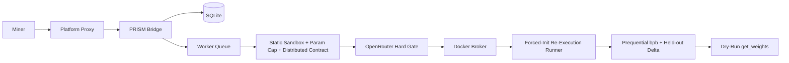
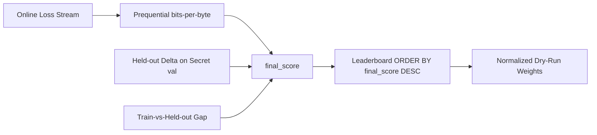

# Architecture

PRISM is a Platform challenge service. It runs as a FastAPI application with SQLite state, internal
Platform authentication, and GPU evaluation through the Platform Docker broker. PRISM measures a
model's ability to learn: miners submit two scripts, the challenge owns the data and the evaluation,
and the validator re-executes the miner's training loop under a forced random init and computes the
score itself.

## High-Level Design



## Main Components

| Component | Responsibility |
| --- | --- |
| FastAPI app | Public and internal HTTP routes |
| Repository | SQLite persistence for submissions, scores, sources, eval jobs, and GPU leases |
| Worker | Claims pending submissions, runs static + LLM gates, dispatches re-execution, finalizes scores |
| Component resolver | Resolves the two-script contract (`architecture.py`/`build_model` + `training.py`/`train`) and computes fingerprints |
| Static sandbox | AST hard-blocks over both scripts, the forced-seed parameter-cap instantiation, and the multi-GPU static contract |
| LLM hard gate | OpenRouter review of both scripts; a `reject` is terminal before any GPU work |
| Container runner | Challenge-owned forced-init re-execution that captures the online loss stream |
| Scoring | Prequential bits-per-byte plus the held-out delta tie-breaker and anti-memorization gap |
| Weights module | Converts normalized completed scores into dry-run Platform weights |

## Platform Integration

Platform is responsible for miner-facing upload security. It verifies signatures, timestamps,
nonces, and hotkey identity before forwarding a submission to PRISM.

PRISM receives verified submissions on:

```text
POST /internal/v1/bridge/submissions
```

The bridge trusts only internal Platform authentication and the verified hotkey header. Miner-supplied
identity headers are not trusted.

## Submission Contract

A submission is a bundle (zip or directory snapshot) containing two distinct scripts:

- `architecture.py` exposes `build_model(ctx)`, a factory returning a `torch.nn.Module`.
- `training.py` exposes `train(ctx)`, the miner-owned training loop entrypoint.

An optional `prism.yaml` may declare the entrypoints and chosen tokenizer. A single combined module
no longer satisfies the contract: the architecture and training roles must be two distinct scripts.

## Execution Model

PRISM does not execute miner submissions directly in the master process. The worker performs static
inspection and the LLM hard gate, then sends the project to an isolated evaluator container through
the Platform Docker broker:

```text
PRISM worker -> DockerExecutor -> Platform Docker broker -> GPU evaluator container
```

The pre-GPU static gates run in this order, and a rejection at any of them is terminal before the
LLM review and before any GPU work:

1. AST sandbox hard-blocks over both scripts.
2. Forced-seed `build_model` instantiation and the 150M parameter cap.
3. The multi-GPU static contract and single-node bound.

Legacy local-CPU and remote-Lium execution paths are not part of the supported backend set.

## Forced-Init Re-Execution (Anti-Cheat Core)

The challenge harness drives every scored run; the miner code only supplies the model and the loop
body.

1. The harness writes a challenge-owned runner that imports the miner's `architecture.py` and
   `training.py`, sets the global seeds and deterministic flags (`torch.manual_seed`,
   `cuda.manual_seed_all`, `use_deterministic_algorithms(True)`, cudnn deterministic) **before** any
   miner code runs, then launches `torchrun --standalone --nnodes=1 --nproc-per-node=1` with
   `MASTER_ADDR=127.0.0.1`.
2. The runner installs an instrumented loss capture. The data iterator yields fresh, single-pass
   batches from the read-only locked `train` split in a challenge-controlled order, and the challenge
   records the model's per-batch loss on each new batch **before** the optimizer updates on it.
   Because the data is single-pass, this online training loss is the prequential code-length by
   construction.
3. The challenge authors `prism_run_manifest.v2.json` from the captured stream. Any manifest the
   miner writes is discarded; any metric the miner reports is ignored.

The eval container is non-root, runs with a read-only rootfs except `artifacts_dir`, uses
`network=none`, and is bounded by a wall-clock budget that is only a safety cap, never part of the
score.

## State Model

PRISM stores state in SQLite. Important tables include:

- `miners`
- `submissions`
- `eval_jobs`
- `gpu_leases`
- `scores`
- `submission_sources`
- `llm_reviews`
- `plagiarism_reviews`
- `epochs`

`eval_jobs` tracks each evaluation attempt (including the `level='l1'` static-tracking placeholder
created at submission time, which is not GPU work). `gpu_leases` records the exclusive single-GPU
lease for a scored run. `scores` holds the challenge-computed prequential bits-per-byte `final_score`
and its metrics payload.

## Scoring Flow

After the forced-init re-execution completes with a valid challenge-authored
`prism_run_manifest.v2.json`, scoring computes everything from the challenge-owned capture:

- the prequential bits-per-byte primary score (lower bpb yields a better `final_score`);
- the held-out delta-over-random-init tie-breaker on the secret `val` split (a near-tie refinement
  that never overrides the primary bpb axis);
- the train-vs-held-out anti-memorization gap, which penalizes an excessive gap;
- a step-0 / smuggled-weights anomaly multiplier that zeroes an anomalous run.



The leaderboard orders by `final_score` with a deterministic earliest-commit-wins tie-break, and
`get_weights` returns one normalized, dry-run weight per hotkey (best submission per hotkey). Weights
are never written on-chain.

## Failure Handling

Submissions can end in one of these states:

- `pending`
- `running`
- `completed`
- `failed`
- `rejected`
- `held`

Rejected submissions fail static review, the two-script contract, the LLM hard gate, or duplicate
review. Failed submissions passed the gates but failed the re-execution, scoring, or infrastructure.
Held submissions are quarantined by the LLM review pending operator attention; the v1-NAS
component-attribution holds and ownership-event machinery have been decommissioned.
