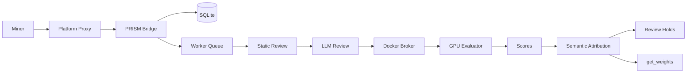
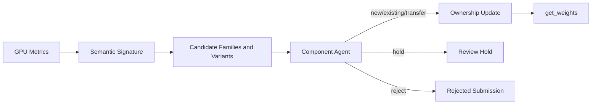
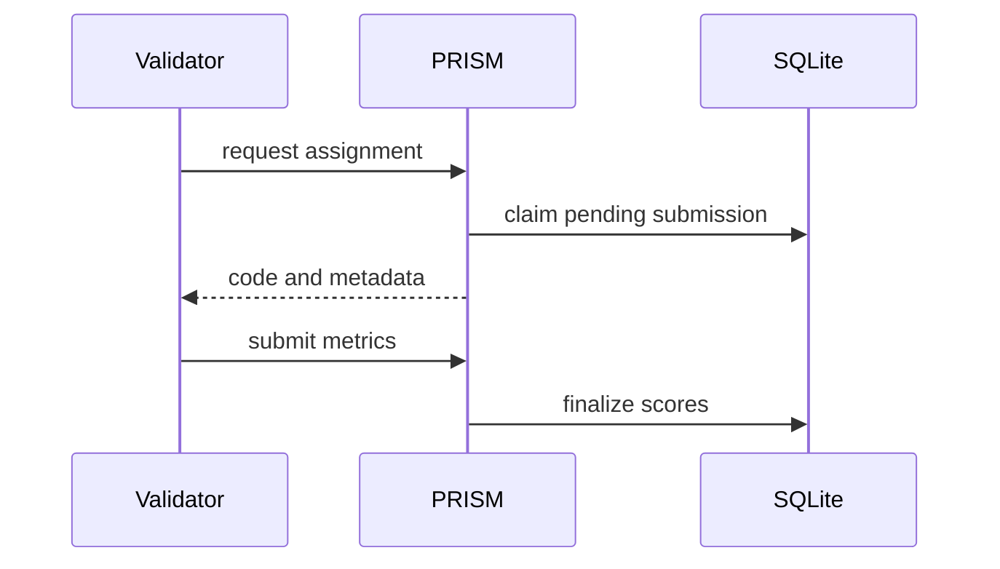

# Architecture

PRISM is a Platform challenge service. It runs as a FastAPI application with SQLite state, internal Platform authentication, and GPU evaluation through the Platform Docker broker.

## High-Level Design



## Main Components

| Component | Responsibility |
| --- | --- |
| FastAPI app | Public and internal HTTP routes |
| Repository | SQLite persistence for submissions, scores, sources, ownership, assignments |
| Worker | Claims pending submissions, reviews code, dispatches evaluation, finalizes scores |
| Component parser | Reads `prism.yaml`, separates architecture and training files, computes fingerprints |
| Semantic signatures | Records hook metadata, call graphs, summaries, and Mermaid sketches for attribution |
| Component agent | Compares submissions against known families and variants, then decides new/existing/transfer/hold/reject |
| Container evaluator | Writes the project into a temporary workspace and runs it in an isolated container |
| Weights module | Converts architecture/training ownership into Platform-compatible hotkey weights |

## Platform Integration

Platform is responsible for miner-facing upload security. It verifies signatures, timestamps, nonces, and hotkey identity before forwarding a submission to PRISM.

PRISM receives verified submissions on:

```text
POST /internal/v1/bridge/submissions
```

The bridge trusts only internal Platform authentication and the verified hotkey header. Miner-supplied identity headers are not trusted.

## Execution Model

PRISM does not execute miner submissions directly in the master process. The worker performs static inspection and optional LLM review, then sends the project to an isolated evaluator container.

The current runtime path is GPU/broker oriented:

```text
PRISM worker -> DockerExecutor -> Platform Docker broker -> GPU evaluator container
```

Legacy local CPU and Lium-style execution are intentionally not part of the supported backend set.

## State Model

PRISM stores state in SQLite. Important tables include:

- `miners`
- `submissions`
- `eval_jobs`
- `scores`
- `submission_sources`
- `llm_reviews`
- `plagiarism_reviews`
- `architecture_families`
- `training_variants`
- `component_scores`
- `component_signatures`
- `component_agent_reviews`
- `component_review_holds`
- `ownership_events`
- `evaluation_assignments`

`component_signatures` preserves deterministic and semantic views of each project. `component_agent_reviews` stores the ownership decision, confidence, and candidate match. `component_review_holds` keeps low-confidence attribution cases out of rewards until an operator resolves them. `ownership_events` records accepted ownership changes and transfers.

## Semantic Attribution Flow

After GPU evaluation, PRISM builds architecture and training signatures from the submitted project:

- source fingerprints and behavior fingerprints;
- architecture and training call graphs;
- first-class hook metadata for `configure_optimizer`, `inference_logits` / `infer`, `compute_loss`, and `train_step`;
- architecture/training summaries;
- optional Mermaid sketches for review.

The component agent compares those signatures against existing architecture families and training variants. It can classify the submission as a new contribution, an existing duplicate, a major transfer-worthy improvement, a rejection, or a hold for manual review.



## Master and Validator Modes

The master can evaluate submissions via the broker-backed worker. PRISM also exposes internal validator-assignment routes so independent validators can be assigned reviewed submissions and return metrics.



## Failure Handling

Submissions can end in one of these states:

- `pending`
- `running`
- `completed`
- `failed`
- `rejected`
- `held`

Rejected submissions fail review or contract validation. Failed submissions passed initial checks but failed evaluation or infrastructure execution.
Held submissions require manual component-attribution resolution and do not affect weights until resolved.
