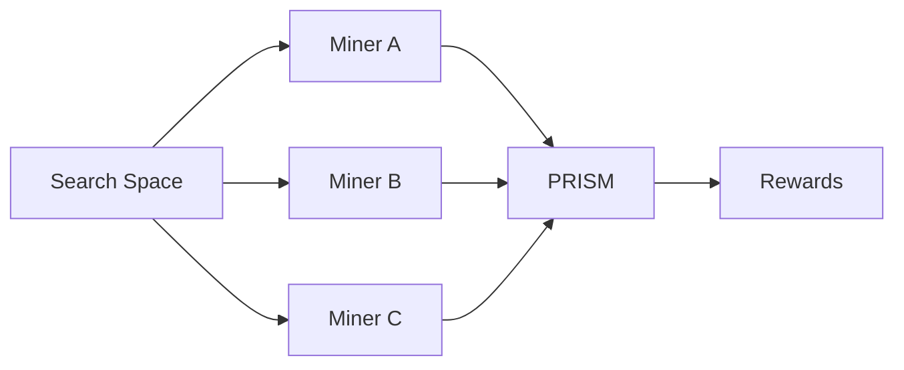

# PRISM Overview

PRISM is a decentralized neural architecture search challenge for Platform Network. It turns Bittensor miners into distributed researchers who propose architecture, training, and inference ideas as executable Python projects.

## Purpose

Frontier models are too expensive to train directly inside a subnet evaluation loop. PRISM evaluates compact proxy models instead. These smaller models make it possible to test architectural motifs, optimizer choices, loss functions, train-step behavior, and inference hooks quickly while still producing useful signals about which ideas may scale.

PRISM is designed to answer questions such as:

- Which architecture families learn fastest under fixed resource budgets?
- Which training recipes improve stability or sample efficiency?
- Which inference hooks improve quality without excessive latency?
- Which optimizer, loss, and train-step changes remain stable as batch, depth, sequence length, and parameter count increase?
- Which ideas remain strong across repeated small-model evaluations?

## Decentralized NAS

Classical NAS is usually centralized: one lab defines a search space, runs experiments, and owns the results. PRISM decentralizes that process:

- Miners explore the search space independently.
- Platform verifies miner identity and forwards submissions.
- PRISM reviews and evaluates the code.
- Architecture and training ownership are recorded on challenge state.
- Weights are emitted to reward the miners who contributed meaningful improvements.

## What Miners Submit

Miners submit ZIP projects containing Python code. A project can define:

- a complete model and training recipe;
- an architecture only;
- a training or inference improvement for an existing architecture.

The optional `prism.yaml` manifest tells PRISM which files belong to the architecture component and which files belong to the training component.

## Why Split Architecture and Training?

A strong model result can come from two different discoveries:

1. A genuinely useful architecture family.
2. Better training, loss, optimizer, or inference code for that architecture.

PRISM tracks those separately. The first miner to discover a meaningful architecture family can keep architecture ownership, while another miner can still earn rewards by improving how that architecture is trained or used.

## Evaluation Philosophy

PRISM evaluations are intentionally small but structured:

- enough training steps to detect learning behavior;
- controlled resource limits;
- repeated metrics support;
- architecture and recipe scores;
- hook usage metrics for optimizer, inference, loss, and training-step code;
- scaling-law signals across loss smoothness, gradient stability, activation behavior, model size, depth, sequence length, and batch growth;
- dynamic thresholds to filter out noise.

The result is a practical decentralized research loop for finding ideas that may be worth testing at larger scale.

## Signals That Matter for Scaling

PRISM is explicitly designed to reduce the risk of rewarding ideas that only look good at tiny scale. Poor predictors include:

- early benchmark scores such as small-run MMLU proxies;
- subjective chat quality;
- final perplexity alone;
- a single seed;
- extremely short training runs without extrapolation.

Better predictors include:

- smooth loss curves with no oscillation;
- stable gradient norms;
- no activation spikes;
- consistent improvement across model sizes;
- depth-scaling behavior;
- sequence-scaling behavior;
- batch-scaling behavior and gradient-noise stability.

See [Scaling Evaluation](scaling.md) for the full policy.
