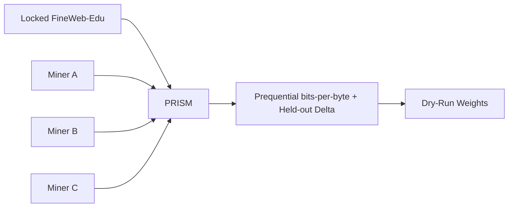

# PRISM Overview

PRISM is an "ability to learn" machine-learning challenge for BASE Network. It turns Bittensor
miners into researchers who submit a model and a training procedure as two executable Python scripts,
then competes them on how well their model learns from scratch on locked data.

## Purpose

PRISM does not ask miners to train a frontier model. It asks a sharper question: given a fixed dataset
and a forced random initialization, how quickly does a model learn? PRISM measures that as online
compression: the better a model predicts each new chunk of text before training on it, the better it
compresses the stream, and the better it scores.

PRISM is designed to answer questions such as:

- Which architectures learn fastest from scratch under a fixed compute budget?
- Which training loops (optimizer, schedule, data ordering, distributed strategy) improve sample efficiency?
- Which ideas hold up when the validator, not the miner, controls the seed, the data, and the metric?

## How It Works

- Miners submit two scripts: a model `architecture.py` and a custom `training.py` loop.
- BASE verifies miner identity and forwards the submission.
- PRISM runs a static AST sandbox and an OpenRouter LLM hard gate over both scripts.
- The validator re-executes the training loop under a forced random init on the locked FineWeb-Edu
  train split, capturing the online loss stream itself.
- PRISM computes a prequential bits-per-byte score with a held-out delta tie-breaker.
- Scores rank on the leaderboard and convert into normalized, dry-run BASE weights.

## What Miners Submit

A submission is a bundle (zip or directory) containing two distinct scripts:

- `architecture.py` exposing `build_model(ctx)` that returns a `torch.nn.Module`;
- `training.py` exposing `train(ctx)` that owns the training loop.

An optional `prism.yaml` can declare the entrypoints and the chosen tokenizer. A single combined
module no longer satisfies the contract.

## Why The Miner Owns The Loop But Not The Score

The miner owns the model and the training procedure, including multi-GPU scaling. The challenge owns
everything that makes the comparison fair and cheat-resistant:

- the dataset content and the secret `val`/`test` splits;
- the forced random seed and deterministic flags;
- the data order and the single-pass online-loss capture;
- the scoring.

Any metric the miner reports and any manifest the miner writes are ignored. Scoring always reads the
challenge-authored `prism_run_manifest.v2.json`.

## Evaluation Philosophy

PRISM evaluations are intentionally compact but honest:

- forced random initialization (fixed seed) so smuggled pretrained weights are inert;
- single-pass, predict-then-train online loss so there is no held-out leakage by construction;
- a metric that integrates the whole loss curve, so single-checkpoint gaming fails;
- compute normalization (tokens and FLOPs, never wall-clock) so a faster GPU does not buy a better score;
- a secret held-out split used only by the challenge scorer for the tie-breaker and the
  anti-memorization gap.

## Signals That Matter

The primary signal is the prequential bits-per-byte: the area under the from-scratch online loss
curve, normalized by the raw UTF-8 bytes consumed. A model that learns faster compresses better and
ranks higher. The held-out delta-over-random-init breaks near-ties, and an excessive
train-vs-held-out gap flags memorization and penalizes the score.

See [Scaling Evaluation](scaling.md) for the multi-GPU contract and the budget model, and
[Scoring and rewards](scoring.md) for the scoring math.
