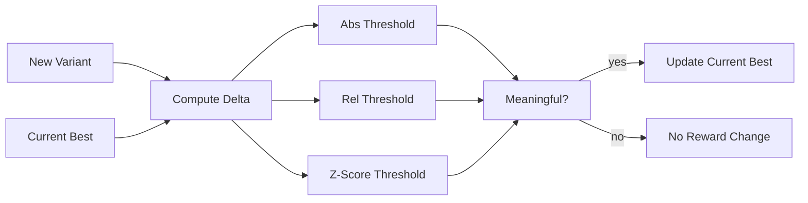

# Scoring and Rewards

PRISM rewards two kinds of contributions:

1. discovering useful architecture families;
2. improving training or inference for known architecture families.

This split makes PRISM a decentralized NAS system rather than a single leaderboard for monolithic submissions.

## Metrics

Evaluator containers return normalized metrics such as:

| Metric | Meaning |
| --- | --- |
| `q_arch` | Architecture quality proxy score |
| `q_recipe` | Training and recipe quality proxy score |
| `train_loss` | Final or observed training loss |
| `eval_loss` / `val_loss` | Evaluation loss |
| `parameter_count` | Model parameter count |
| `inference_latency_ms` | Optional inference latency |
| `hook.*.present` | Whether a first-class optional hook exists |
| `hook.*.used` | Whether the evaluator actually used that hook |
| `loss_smoothness` | Loss-curve smoothness or oscillation penalty signal |
| `grad_norm_mean` / `grad_norm_max` | Gradient-norm stability signals |
| `activation_spike_rate` | Activation-spike signal for large-scale instability |
| `scaling_consistency` | Consistency of gains across parameter-count probes |
| `depth_scaling_score` | Stability when depth increases under comparable compute |
| `sequence_scaling_score` | Stability when context length increases |
| `batch_scaling_score` | Stability when global batch increases |
| `penalty` | Optional evaluator penalty |

The final score is still stored for leaderboard compatibility, but component ownership drives validator weights when component rewards exist.

PRISM deliberately treats final perplexity or a single benchmark score as insufficient. Scaling-aware metrics are preferred because many designs look strong at small scale but fail when residual streams, normalization, routing, KV cache, or activations are stressed.

## Architecture Ownership

PRISM computes an architecture fingerprint from files declared under the `architecture` section of `prism.yaml`.

The first accepted submission for a new architecture family creates an `architecture_families` record:

- `family_hash`
- `arch_fingerprint`
- `behavior_fingerprint`
- `owner_hotkey`
- `owner_submission_id`
- `canonical_submission_id`
- `q_arch_best`

The owner keeps architecture reward exposure for that family. Later submissions may update the canonical best submission if they meaningfully improve `q_arch`, but they do not automatically take first-discovery ownership.

## Training Variant Ownership

Training and inference code are fingerprinted separately from architecture code. For each architecture family, PRISM tracks training variants.

A new training variant becomes the current best only when it beats the existing best by a meaningful margin. If it does, the training contributor receives training reward exposure for that architecture.

Training ownership includes code in:

- `configure_optimizer`;
- `inference_logits` / `infer`;
- `compute_loss`;
- `train_step`;
- training helper files declared in `prism.yaml`.

These hooks are fingerprinted and reviewed semantically so useless differences such as renaming functions, moving files, wrapping the same model, or changing constants without meaningful scaling impact do not create new ownership.

## Agent-First Semantic Attribution

PRISM stores deterministic signatures and semantic summaries for each submission:

- source fingerprints;
- architecture and training call graphs;
- hook metadata;
- Mermaid architecture sketches;
- architecture and training summaries.

Agent-first review compares a new submission against candidate architecture families and training variants. The agent decision can be:

- `new`;
- `existing`;
- `transfer`;
- `hold`;
- `reject`.

Low-confidence cases are held for review and do not affect weights until resolved. Major improvements can transfer current ownership when the semantic decision and metric thresholds both support it.

## Dynamic Thresholds

PRISM uses configurable thresholds to avoid rewarding noise:

| Setting | Purpose |
| --- | --- |
| `architecture_improvement_min_delta_abs` | Minimum absolute architecture-score improvement |
| `architecture_improvement_min_delta_rel` | Minimum relative architecture-score improvement |
| `training_improvement_min_delta_abs` | Minimum absolute training-score improvement |
| `training_improvement_min_delta_rel` | Minimum relative training-score improvement |
| `training_improvement_z_score` | Required noise-adjusted improvement margin |
| `training_metric_default_std` | Default standard deviation when repeats do not report one |

The required improvement is the maximum of:

- absolute delta threshold;
- relative delta threshold;
- z-score threshold based on reported variance.

For transfer decisions, PRISM uses stricter transfer thresholds. This prevents a miner from taking ownership of an architecture or training variant through tiny noisy gains.



## Weight Aggregation

When component rewards exist, `get_weights` aggregates:

- architecture family ownership weighted by `architecture_reward_weight`;
- current best training variant ownership weighted by `training_reward_weight`.

Scores are summed by hotkey and normalized before returning to Platform.

Example:

```json
{
  "challenge_slug": "prism",
  "epoch": 123,
  "weights": {
    "5F...architect": 0.65,
    "5G...trainer": 0.35
  }
}
```

## Why This Matters

Without component scoring, a miner who changes a learning rate could capture the full reward for an architecture someone else discovered. Without thresholds, random metric noise could create false improvements. PRISM avoids both problems by separating attribution and requiring meaningful deltas.
