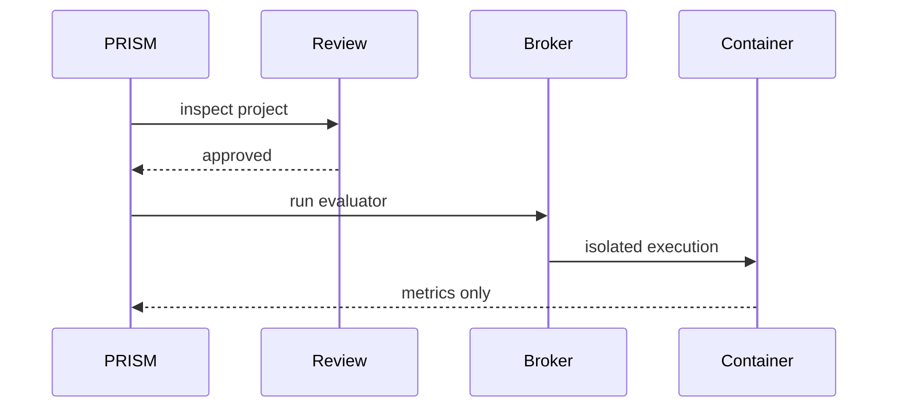

# Security Model

PRISM evaluates untrusted miner code. Its security model assumes submissions may be malicious and therefore separates identity verification, static review, and execution isolation.

## Identity and Upload Security

Miner-facing uploads are handled by Platform. Platform verifies:

- hotkey identity;
- Substrate/Bittensor-style signatures;
- timestamps;
- nonces;
- request freshness;
- challenge routing.

After verification, Platform forwards the payload to PRISM through:

```text
POST /internal/v1/bridge/submissions
```

PRISM trusts the verified hotkey header only on authenticated internal requests.

## Internal Authentication

Internal endpoints require the shared Platform challenge token:

```text
Authorization: Bearer <shared-token>
```

The token is read from `PRISM_SHARED_TOKEN`, `CHALLENGE_SHARED_TOKEN`, or a configured secret file.

## Static Review

Before evaluation, PRISM inspects Python code for:

- forbidden imports;
- forbidden calls;
- unsafe attributes;
- invalid top-level code;
- missing contract functions;
- unsupported project structure.

The review is applied to all Python files in the submitted project. The entrypoint must satisfy the model contract, while helper files may be contract-free but still pass safety checks.

## LLM Policy Review

PRISM can optionally run LLM review with configurable rules. The default review intent is to reject code that attempts:

- secret exfiltration;
- filesystem or process escape;
- network escape;
- hidden behavior unrelated to the model contract;
- plagiarism or copied miner code.

LLM review can be advisory or required depending on operator configuration.

## Plagiarism and Similarity

PRISM stores source snapshots and can compare submissions against prior code. Static similarity and optional pair-sandbox review help detect copied submissions.

## ZIP Hardening

ZIP extraction rejects:

- symlinks;
- path traversal;
- unsafe paths;
- unsupported file types;
- excessive file count;
- excessive total bytes.

This prevents archive-level attacks before code review begins.

## Execution Isolation

PRISM does not execute submitted code inside the API or worker process. Evaluation happens in a container launched through the Platform Docker broker.

Container limits include:

- CPU quota;
- memory and swap limits;
- PID limits;
- network policy;
- read-only runtime option;
- optional GPU type and count.



## Operational Guidance

- Use real secret files in production, not inline tokens.
- Keep public submissions disabled when PRISM is deployed only behind Platform.
- Run broker-backed GPU evaluation rather than local execution.
- Enable LLM review for production subnet operation.
- Monitor rejected and failed submissions separately.